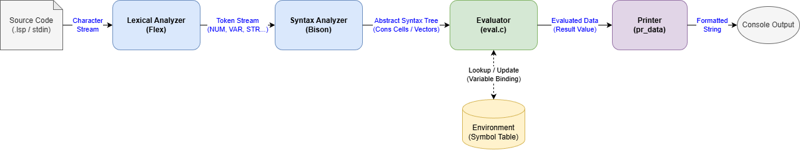
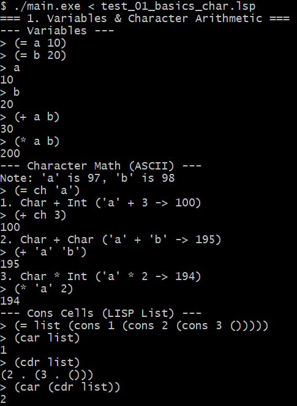
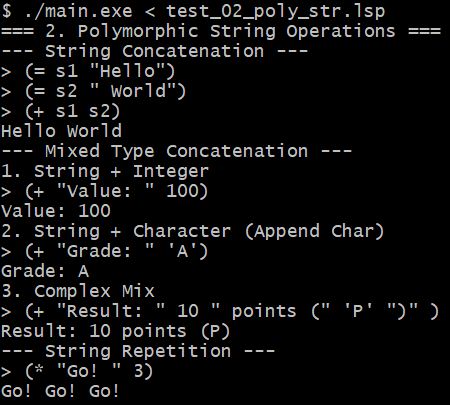
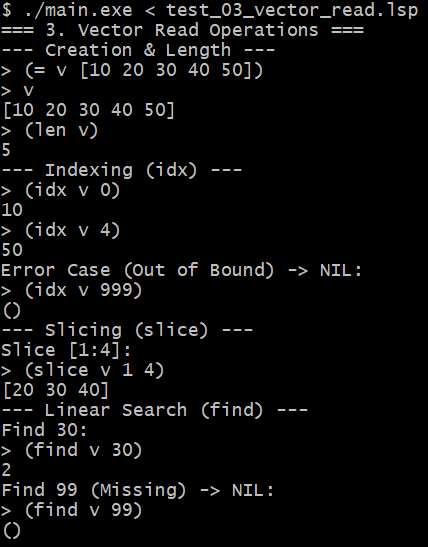
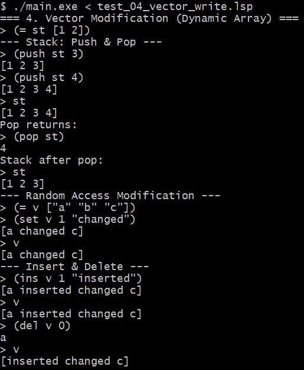
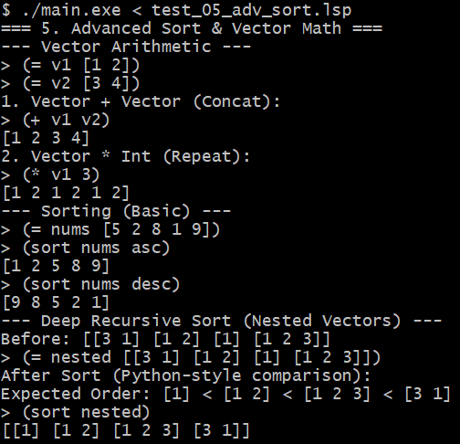

# LISP-style Interpreter

> **"Flex/Bison 기반으로 구현한 LISP 스타일 인터프리터: 리스트 처리 + 다형성 연산 + 동적 벡터"**

> [!NOTE]
> 본 프로젝트는 **2025학년도 2학기 부산대학교 컴파일러(Compiler)** 과목의 텀 프로젝트로 진행되었습니다.

[](https://en.cppreference.com/w/c)
[](https://github.com/westes/flex)
[](https://www.gnu.org/software/bison/)
[](https://www.kernel.org/)

---

## 프로젝트 소개

**LISP-style Interpreter**는 C 언어로 구현한 인터프리터로, Flex/Bison 기반 파싱 파이프라인 위에 동적 타입 런타임을 구성했습니다.

기본적인 LISP 리스트 연산(`cons`, `car`, `cdr`)뿐 아니라, 다음 기능을 확장 구현했습니다.

- 동적 타입 시스템: `Nat`, `Chr`, `Str`, `Sym`, `List`, `Vector`
- 다형성 연산자: `+`, `*`가 숫자/문자열/벡터에 대해 타입별 동작
- 이기종 원소 벡터: 하나의 벡터에 여러 타입 동시 저장
- 벡터 읽기/쓰기 연산: `idx`, `slice`, `find`, `set`, `ins`, `del`, `push`, `pop`
- 재귀 비교 기반 정렬: 중첩 벡터까지 비교 가능한 `sort`

---

## 핵심 기술

| 항목 | 적용 내용 |
|------|------|
| **파서 구조** | `flex(token.l)` + `bison(ast.y)` 조합으로 토큰화/구문분석 |
| **평가기(eval)** | 심볼 조회, 특수형(`quote`, `=`), 연산자 적용, 벡터 원소 eager eval |
| **환경 모델** | 연결 리스트 기반 환경 프레임, 상위 스코프 재귀 조회 |
| **다형성 + 연산** | 숫자 합/곱, 문자열 연결/반복, 벡터 연결/반복 |
| **벡터 구현** | 동적 배열(capacity doubling), 삽입/삭제/인덱싱/슬라이싱 |
| **정렬/비교** | 타입 우선순위 + 벡터 사전식(lexicographical) 재귀 비교 |

---

## 시스템 다이어그램



---

## 프로젝트 구조

```text
LISP-style-Interpreter/
├── ast.y                     # Bison 문법 규칙
├── token.l                   # Flex 렉서 규칙 (문자열 escape 처리 포함)
├── main.c                    # 인터프리터 엔트리 + 내장 함수 등록
├── eval.c / eval.h           # 평가기
├── env.c / env.h             # 환경(변수 바인딩) 관리
├── data.c / data.h           # 공용 데이터 구조(Tag Union, Vector)
├── bop.c / bop.h             # 기본 연산(cons/car/cdr, +, *)
├── vop.c / vop.h             # 벡터 연산(len/idx/slice/find/set/ins/del/push/pop/sort)
├── Makefile                  # 빌드/테스트 자동화
├── run_demo.sh               # 테스트 케이스 일괄 실행 스크립트
├── test_01_basics_char.lsp
├── test_02_poly_str.lsp
├── test_03_vector_read.lsp
├── test_04_vector_write.lsp
├── test_05_adv_sort.lsp
├── testcase_capture/
│   ├── test1.png
│   ├── test2.png
│   ├── test3.png
│   ├── test4.png
│   └── test5.png
└── README.md
```

---

## 지원 문법/연산 요약

| 분류 | 예시 |
|------|------|
| 변수 할당 | `(= a 10)` |
| 리스트 | `(cons 1 (cons 2 ()))`, `(car list)`, `(cdr list)` |
| 벡터 리터럴 | `[1 2 3]`, `[[1] [1 2]]` |
| 벡터 생성 함수 | `(vec 1 "a" [2 3])` |
| 다형성 덧셈 | `(+ 1 2)`, `(+ "A" "B")`, `(+ [1] [2])` |
| 다형성 곱셈 | `(* 2 3)`, `(* "Go" 3)`, `(* [1 2] 2)` |
| 벡터 읽기 | `(len v)`, `(idx v 0)`, `(slice v 1 4)`, `(find v 30)` |
| 벡터 쓰기 | `(set v 1 "x")`, `(ins v 1 99)`, `(del v 0)`, `(push v 3)`, `(pop v)` |
| 정렬 | `(sort nums asc)`, `(sort nums desc)`, `(sort nested)` |

---

## 실행 방법 (Linux / bash)

### 1. 저장소 클론

```bash
git clone https://github.com/mseoky/LISP-style-Interpreter.git
cd LISP-style-Interpreter
```

### 2. 의존성 설치

Ubuntu/Debian 기준:

```bash
sudo apt-get update
sudo apt-get install -y build-essential flex bison
```

### 3. 전체 테스트 데모 한 번에 실행 (`run_demo.sh`)

현재 `run_demo.sh`는 `./main.exe`를 호출하므로, Linux에서는 빌드 후 심볼릭 링크를 한 번 만들어 실행하면 됩니다.

```bash
make
ln -sf ./main ./main.exe
chmod +x run_demo.sh
./run_demo.sh
```

### 4. 인터프리터 직접 실행 (대화형)

```bash
make
./main
```

예시 입력:

```lisp
(+ 1 2)
(= v [1 2 3])
(push v 4)
(sort v desc)
```

종료: `Ctrl + D`

---

## 테스트 결과

### Test 1. Basics & Character Math



### Test 2. Polymorphic String Operations



### Test 3. Vector Read Operations



### Test 4. Vector Write Operations



### Test 5. Advanced Sort & Vector Math



---

## 참고

- 원본 프로젝트 설명: `README`
- 최종 보고서: `report.pdf`
- 주요 실행 스크립트: `run_demo.sh`
- 빌드 규칙: `Makefile`
